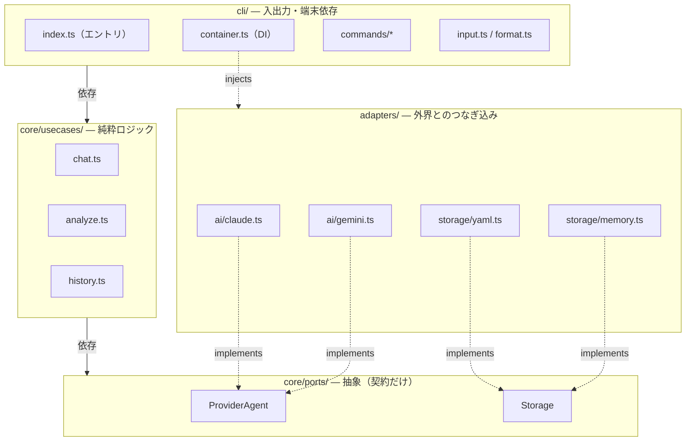

# アーキテクチャ / 設計ノート

tanren を今後運用・拡張していくための設計ドキュメント。コードの構造と、なぜそうなっているか（設計判断と割り切り）をまとめる。

## 1. tanren とは

エンジニア向けの **「壁打ち（対話）＋ 実力解析」CLI**。機能の核は2つ。

- **ask（壁打ち）**: AI コーチと対話する。やり取りは全て保存される。
- **report（解析）**: 溜まった壁打ち履歴を、複数の「能力軸（Axis）」で AI に採点・講評させ、レポートとして残す。

report は前回レポートを踏まえて成長を測る（差分評価）ため、単なるチャットではなく「継続的に実力を可視化する」点が肝。

## 2. 全体アーキテクチャ（ヘキサゴナル）

依存の向きは **常に外 → 内**。内側（core）は外側（端末・AI・ファイル）を一切知らない。



依存は常に **外 → 内**（`cli → usecases → ports`）。adapters は ports を **implements** し、`container` が起動時に実体を **注入**する。だから内側（core）は外側を一切知らない。

`core/usecases` は `core/ports` の interface しか見ない。実物（Claude を叩く／YAML に書く）は adapters が実装し、起動時に DI で注入する。結果として AI もストレージも差し替え自在で、core はモックだけでテストできる。

## 3. ディレクトリ構成

| パス | 役割 |
| --- | --- |
| `src/cli/index.ts` | **エントリポイント**。commander で引数を解釈し、メニュー or 各コマンドへ振る |
| `src/cli/container.ts` | DI コンテナ。storage と provider を組み立てる唯一の場所 |
| `src/cli/commands/*` | 各コマンドの入出力（setup / ask / report / actions / history） |
| `src/cli/input.ts` | 壁打ちの複数行入力 reader（後述） |
| `src/cli/format.ts` | 表示整形（リキャップ・日付・軸ラベル解決） |
| `src/core/ports/*` | ポート（`ProviderAgent` / `Storage`） |
| `src/core/usecases/*` | ロジック（`chat` / `analyze` / `history`） |
| `src/core/axes.ts` | デフォルト能力軸 `DEFAULT_AXES` |
| `src/adapters/ai/*` | AI 実装（claude / gemini）とレジストリ |
| `src/adapters/storage/*` | 保存実装（yaml / memory）とレジストリ |

## 4. ポート（内と外の境界）

### ProviderAgent（`core/ports/ai-provider.ts`）
```ts
interface ProviderAgent {
  capabilities: { readsLocalSource: boolean }  // ローカルのコードを読めるか
  chatStream(systemPrompt, messages, onChunk, signal?): Promise<string>
}
```
「システムプロンプトと会話履歴を渡すと、`onChunk` で逐次返しつつ最終全文を返す」。`signal` で中断（Ctrl+C）対応。`Provider.setup(apiKey?)` が `ProviderAgent` を生成する。

### Storage（`core/ports/storage.ts`）
4つの小さな store の合成。usecase は必要な store だけを型で要求する（最小権限）。

- `SessionStore` … 壁打ちログ（`Session`）
- `ReportStore` … 解析結果（`Report`）
- `AxisStore` … 能力軸（`Axis`）
- `ConfigStore` … 設定（provider 名・APIキー）

例: `analyze` のシグネチャは `SessionStore & ReportStore & AxisStore` で、ConfigStore は要求しない。何を触るかが型から読める。

## 5. データモデルと永続化

`adapters/storage/yaml.ts` が `~/.tanren/` 配下の YAML に保存する。

| 型 | 中身 | ファイル |
| --- | --- | --- |
| `Session` | `{ id, createdAt, messages[] }` 1往復 = 1レコード | `sessions.yaml` |
| `Report` | `{ id, createdAt, abilities[] }` 解析1回分 | `reports.yaml` |
| `AbilityReport` | `{ axis, summary, nextActions[], score }` 軸1つの評価 | （Report 内） |
| `Axis` | `{ key, label, focus }` 能力軸の定義 | `axes.yaml` |
| Config | `provider` 名 / `<name>_api_key` | `config.yaml` |

YAML 層の堅さ（壊さない設計）:

- **読み込みは zod で検証**。壊れていたら例外で中止し、ファイルを温存（上書きで潰さない）。
- **書き込みは temp ファイルに書いて `rename`**（アトミック）。途中で落ちても本体は壊れない。
- `id` は「最後の id + 1」で連番採番。
- `Axis` は未設定なら `core/axes.ts` の `DEFAULT_AXES`（技術的判断・設計力の2軸）にフォールバック。ユーザーは `axes.yaml` を編集して自分の評価軸を定義できる。

## 6. DI コンテナと配線

`cli/container.ts` が内と外を結ぶ唯一の場所。

```ts
buildContainer('yaml') → {
  storage,                               // YamlStorage の実体
  buildProvider: () => resolveProvider(storage),  // config を見て Claude/Gemini を組む（遅延）
}
```

`resolveProvider`（`adapters/ai/registry.ts`）は config の `provider` 名を読み、`requiresApiKey` なら APIキーも取り、対応する `Provider.setup()` で `ProviderAgent` を作る。`buildProvider` を**サンク（遅延関数）**にしてあるのは、APIキー未設定でも起動だけは通し、AI が要るコマンドの実行時に初めて解決させるため。

`cli/index.ts` がエントリ:
- 引数なし `tanren` → `runMenu()`（@inquirer の select で対話メニューをループ）
- 引数あり `tanren ask` 等 → `oneShot()`（一発実行して終了）
- 両方とも `dispatch(command)` に集約。`ensureConfigured()` が未設定時に setup へ誘導する。

## 7. ユーザーフロー

### setup（初回）
プロバイダ選択（Gemini/Claude）→ 必要なら APIキー入力 → `config.yaml` 保存 → `axes.yaml` 初期化。Claude は「Claude Code のログインを使う」ので APIキー不要、Gemini は必要。この差は `Provider.requiresApiKey` で表現。

### ask（壁打ち）— `commands/ask.ts` + `usecases/chat.ts`
1. 入室時に直近 `RECENT_TURNS`（=5）往復を `formatRecap` で表示（前回の続きが見える）。
2. ループ: `readMultilineInput('あなた: ')` で入力 → `chat()`。
3. `chat()` は直近5往復を履歴として並べ、`buildSystemPrompt(axes)` を system に、ユーザー入力を末尾に付けて `provider.chatStream` を呼ぶ。応答後、1往復を1 Session として保存。

ポイント:
- システムプロンプトに **能力軸（axes）を織り込む**。評価軸がそのままコーチの掘り下げ観点になる。
- コーチに渡す履歴窓 `RECENT_TURNS` は入室リキャップと同じ定数（表示と AI 文脈をズラさない）。
- 中断は `AbortController`。Ctrl+C 1回で応答中断、2回で `exit(130)`。

### report（解析）— `commands/report.ts` + `usecases/analyze.ts`
1. `selectSessions()`: **前回レポート以降の新規ログだけ**、最大 `SESSION_LIMIT`（=20）件。過去分は前回レポートに畳み込み済みなので二重評価しない。
2. 各 axis ごとに、その軸専門のメンターとして評価させる。前回の同軸サマリと前回の「次のアクション」をプロンプトに入れ、**取り組めたか・成長したか**を必ず評価させる。
3. 出力テキストを `parseScore`（末尾「スコア: N/5」）と `parseNextActions`（「次のアクション:」以降の箇条書き）で**構造化データに落とす**。採点できなければ前回点を据え置き。
4. `saveReport`。

### actions — `commands/actions.ts`
最新レポートの `nextActions` だけを表示。新しい状態は持たず、レポートから導出するだけ（表示で導出できるものは状態を持たない）。

### history — `commands/history.ts` + `usecases/history.ts`
- 引数なし: レポート一覧 ＋ 軸ごとのスコア推移（`3 → 4 → 4`）。
- `history <id>`: そのレポート詳細を、前回との差分（`★★★★☆ 4/5 (前回 3 → +1)`）付きで表示。

## 8. プロバイダ抽象とコーチのツール権限

両プロバイダとも `ProviderAgent` を実装するが中身は別物。

- **claude.ts**: `@anthropic-ai/claude-agent-sdk` の `query` を使う。`readsLocalSource: true`。ask で渡されたパスを実際に読んで議論できる。
- **gemini.ts**: APIキーで Google のモデルを叩く。`readsLocalSource: false`（ローカルは読まない）。

usecase はこの違いを知らない。`capabilities.readsLocalSource` を見て ask の案内文だけ変える（能力差を capability フラグで表現し、分岐を最小化）。

### コーチのツール権限（claude.ts）— 重要な運用方針
コーチは **読み取り専用** に閉じてある。Agent SDK の3つの仕組みを役割分担させている。

| 仕組み | 設定 |
| --- | --- |
| `allowedTools` | `Read / Grep / Glob`（無条件で自動許可） |
| `disallowedTools` | `Write / Edit / NotebookEdit`（文脈から除外。編集ツールの存在すら見せない） |
| `canUseTool` | Bash を関門で吟味し、**読み取り専用 git のときだけ許可** |

`isReadonlyGit` の安全性は二段構え:
1. **メタ文字の構文ブロック**: `; & | < > \` $ ( )` 改行 を含めば即拒否。`git log; rm -rf` のような連結・リダイレクト・コマンド置換を不可能にする。
2. **allowlist 方式**: 許可する git サブコマンド（diff/log/show/status/blame など）だけ true。未知のサブコマンドは自動で安全側（拒否）に倒れる。

さらに `TOOL_HINT`（プロンプト）で「実行できるのは Read/Grep/Glob と読み取り専用 git だけ。編集・git 書き込み・tsc/npm/テスト/ビルドは実行できないので、できる前提で提案するな」と明示。**機構（canUseTool）＝実際にブロック / プロンプト（TOOL_HINT）＝そもそも期待させない** の両輪。

設計意図: コーチは壁打ち相手＋実力解析役であって、コードを編集する実行エージェント（Claude Code の領分）ではない。「読む力は増やすが、書き込みは構造的に不可能」を保つ。

## 9. 入力層 input.ts の設計と既知の割り切り

`readMultilineInput` は端末の生入力を自前でパースする層。`@inquirer` の input が「最初の改行で確定」してペーストが切れる問題を避けるため自作した。

操作モデル:
- **Enter（`\r`）= 送信 / Ctrl+J（`\n`）・Shift+Enter = 改行 / ペースト = 改行ごと丸ごと取り込む / Ctrl+C = キャンセル**
- Shift+Enter は Kitty キーボードプロトコル（`\x1b[>1u`）対応端末でのみ CSI-u として届く。非対応端末では Ctrl+J かペーストで改行する。

実装の柱:
- **ブラケットペースト**（`\x1b[?2004h`）で `200~`…`201~` に囲まれたペースト区間を判定。区間内の改行は本文として残す（送信トリガーにしない）。
- **全体再描画**: buffer を正とし、キーのたびに入力欄を丸ごと描き直す（`render()`）。これにより複数行をまたいだ削除・全消しが画面に反映される。`displayWidth`（日本語=幅2）と行折り返しを計算してカーソル位置を求める。
- **CSI-u 解読**（`parseCsiU`）: Kitty 形式で届く Enter/Shift+Enter/Backspace を拾う。

### 既知の割り切り（YAGNI / 意図的に未対応）
- **render() はビューポート内に収まる前提**。buffer が画面下端を超えて端末がスクロールすると、`\x1b[NA`（N行上へ戻る）が画面最上行でクランプし、戻る位置がズレて表示が崩れる。手入力は数行で収まる前提で切ったが、**長文ペーストでは超えうる**ため、ここは割り切りが甘い。破綻しても buffer の値自体は正しく（submit は正しい文字列を返す）、内容が縮むか次の短い入力で自己修復する。長文ペーストで実害が出たら、`process.stdout.rows` と描画行数を突き合わせて全画面クリア（`\x1b[2J\x1b[H`）に切り替える等の保険を検討する。
- **非対話（パイプ）は 1行 = 1入力**。`\n` で即送信し、複数行を1メッセージにはしない。対話時のブラケットペーストのような「1メッセージの境界」を表す手段が非対話には無いため。

## 10. ビルドと公開フロー

- **ビルド**: tsup（esbuild）で `src/cli/index.ts` → `dist/index.js`（CJS）。先頭に `#!/usr/bin/env node` の banner。`package.json` の `bin.tanren` が `dist/index.js` を指す。
- **バージョン**: `tsup.config.ts` の `define` で `__APP_VERSION__` に `package.json` の version を埋め込む（単一ソース）。dev（tsx）では `typeof` ガードで `0.0.0-dev` にフォールバック。
- **公開**: GitHub Actions が main の push で動き、**package.json の version が npm 上にまだ無いときだけ** publish する。`--provenance` 付き。秘密情報は `TANREN_CICD`。
- **リリース手順**: version を bump → PR → マージ → CI が自動 publish → `npm i -g tanren@latest`。各リリースに version bump が必須（同一 version は publish されない）。

## 11. 設計上の指針（まとめ）

1. **ポート2本（AI / Storage）で内外を遮断** — 差し替え自在、core はテストで完結。
2. **usecase は純粋的**（端末も AI も知らない）— `analyze`/`chat` 単体テストが軽い。
3. **能力軸（Axis）が一級市民** — コーチの掘り下げ観点にも解析の評価軸にも同じものを使い、ユーザーが `axes.yaml` で再定義できる。
4. **レポートが成長を畳み込む** — 毎回フルログを送らず「前回以降＋前回サマリ」で差分評価。スコア推移として可視化。
5. **YAML 層は壊れにくい** — zod 検証＋アトミック書き込み＋壊れたら温存。
6. **コーチは読み取り専用** — 機構（canUseTool/disallowedTools）とプロンプト（TOOL_HINT）の両輪で「読むが書かない」を保証。
7. **割り切りは言語化して残す** — input.ts のビューポート前提、非対話=1行入力など、YAGNI で切った前提と「いつ崩れるか」を本ドキュメントに明記し、忘れない。
